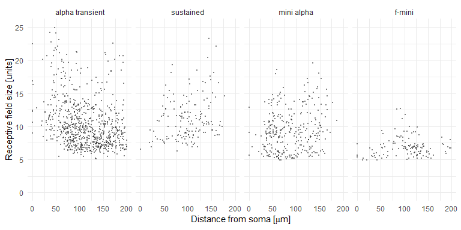
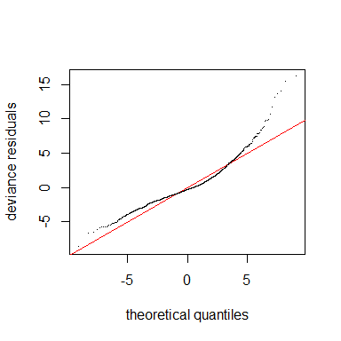
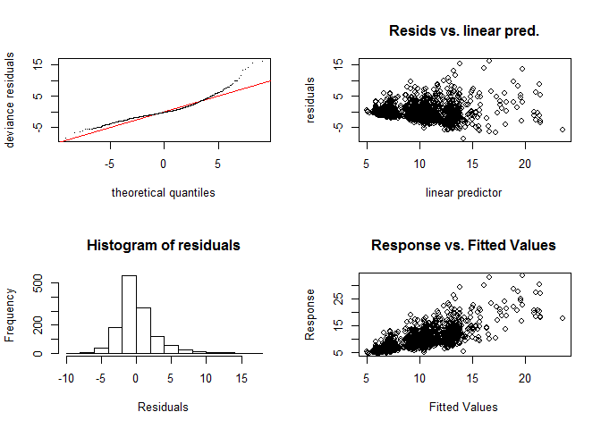
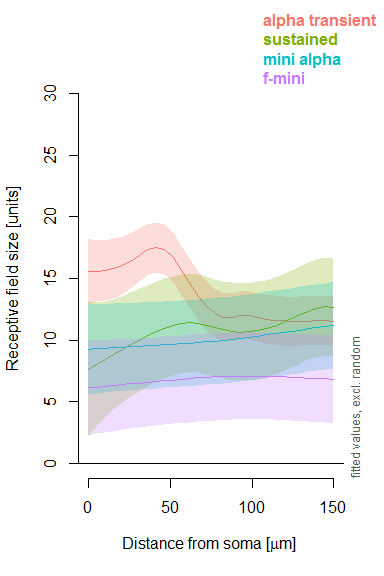
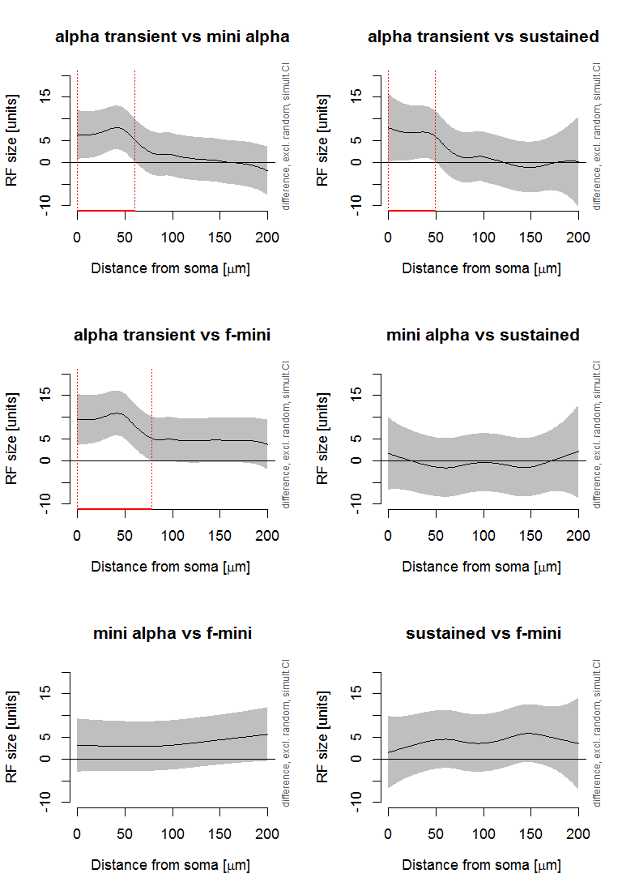
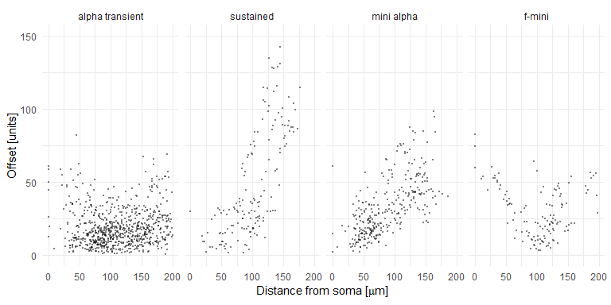
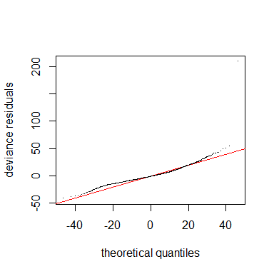
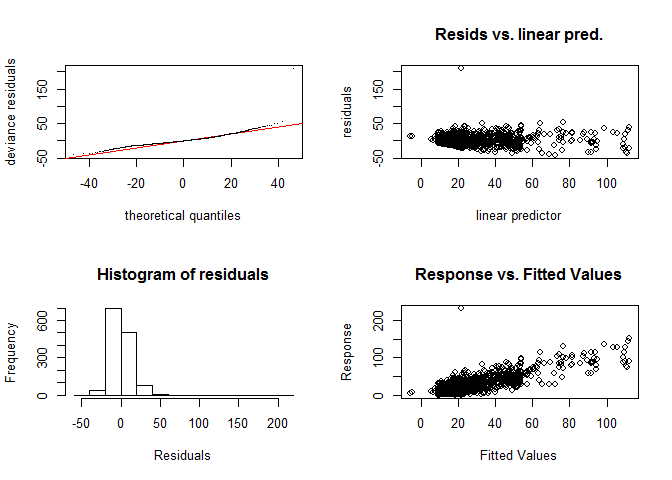
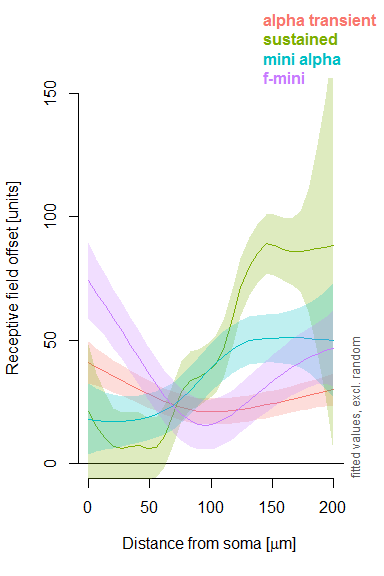
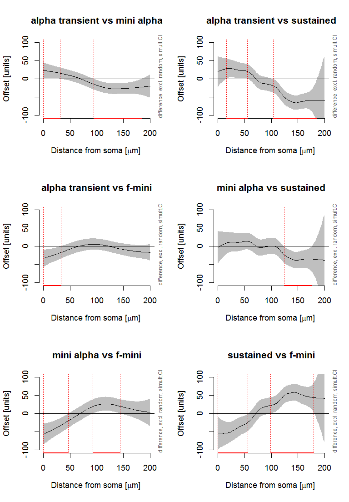

Analysis for RGC Dendrite Project (Integration of RFs)
================
Philipp Berens
July 31, 2019

\#\#Load data

``` r
data <- read.csv("../../data/processed/all_roi.csv", header=T)

data <- plyr::rename(data, c("dendritic_distance_to_soma"="soma_dist", "sRF_asd_upsampled_cntr_size_65"="rf_size"))

data <- plyr::rename(data, c("cntrs_offset_calibrate_to_rois_65"="offset", "cntr_quality"="quality"))

data <- dplyr::select(data, c("exp_date", "recording_id", "roi_id", "type", "soma_dist", "rf_size", "quality", "offset"))

data$type <- factor(data$type)
data$type <- revalue(data$type, c("0"="alpha transient", "1"="sustained", "2" = "mini alpha", "3"="f-mini"))

data <- dplyr::filter(data, (data$soma_dist<200)) # & (data$soma_dist>5))

data <- dplyr::filter(data, data$quality==1)

# we use cell id as a random factor
data$exp_date = factor(data$exp_date)
```

\#\#Receptive field sizes

\#\#\#All cell types individually

    ## Warning: Removed 11 rows containing missing values (geom_point).

<!-- -->

\#\#\#Statistical analysis

We first fit again a model without random effects for cell\_id:

``` r
m1 <- gam(rf_size ~ type + s(soma_dist, by=type, k=50), data = data)
summary(m1)
```

    ## 
    ## Family: gaussian 
    ## Link function: identity 
    ## 
    ## Formula:
    ## rf_size ~ type + s(soma_dist, by = type, k = 50)
    ## 
    ## Parametric coefficients:
    ##                Estimate Std. Error t value Pr(>|t|)    
    ## (Intercept)     10.9384     0.1315  83.167  < 2e-16 ***
    ## typesustained    0.4065     0.3521   1.155    0.248    
    ## typemini alpha  -1.3631     0.2562  -5.321 1.21e-07 ***
    ## typef-mini      -4.0205     0.3410 -11.789  < 2e-16 ***
    ## ---
    ## Signif. codes:  0 '***' 0.001 '**' 0.01 '*' 0.05 '.' 0.1 ' ' 1
    ## 
    ## Approximate significance of smooth terms:
    ##                                     edf Ref.df      F p-value    
    ## s(soma_dist):typealpha transient 11.704 14.564 11.297 < 2e-16 ***
    ## s(soma_dist):typesustained        4.377  5.526  2.904 0.01048 *  
    ## s(soma_dist):typemini alpha       1.000  1.000  7.542 0.00611 ** 
    ## s(soma_dist):typef-mini           1.833  2.307  0.391 0.61471    
    ## ---
    ## Signif. codes:  0 '***' 0.001 '**' 0.01 '*' 0.05 '.' 0.1 ' ' 1
    ## 
    ## R-sq.(adj) =  0.203   Deviance explained = 21.6%
    ## GCV = 12.473  Scale est. = 12.257    n = 1324

Then a model with random effects for
cell\_id:

``` r
m2 <- gam(rf_size ~ type + s(soma_dist, by=type, k=50) + s(exp_date, bs="re"), data = data)
summary(m2)
```

    ## 
    ## Family: gaussian 
    ## Link function: identity 
    ## 
    ## Formula:
    ## rf_size ~ type + s(soma_dist, by = type, k = 50) + s(exp_date, 
    ##     bs = "re")
    ## 
    ## Parametric coefficients:
    ##                Estimate Std. Error t value Pr(>|t|)    
    ## (Intercept)     12.7394     0.9679  13.162  < 2e-16 ***
    ## typesustained   -1.4720     2.2130  -0.665  0.50606    
    ## typemini alpha  -2.2966     2.0233  -1.135  0.25656    
    ## typef-mini      -5.8777     2.0320  -2.893  0.00389 ** 
    ## ---
    ## Signif. codes:  0 '***' 0.001 '**' 0.01 '*' 0.05 '.' 0.1 ' ' 1
    ## 
    ## Approximate significance of smooth terms:
    ##                                     edf Ref.df      F  p-value    
    ## s(soma_dist):typealpha transient 10.628 13.241 21.584  < 2e-16 ***
    ## s(soma_dist):typesustained        4.821  6.094  2.634 0.014754 *  
    ## s(soma_dist):typemini alpha       1.599  2.015  7.568 0.000535 ***
    ## s(soma_dist):typef-mini           1.806  2.265  0.507 0.564331    
    ## s(exp_date)                      26.410 27.000 33.919  < 2e-16 ***
    ## ---
    ## Signif. codes:  0 '***' 0.001 '**' 0.01 '*' 0.05 '.' 0.1 ' ' 1
    ## 
    ## R-sq.(adj) =  0.529   Deviance explained = 54.6%
    ## GCV = 7.5275  Scale est. = 7.2474    n = 1324

Model comparison using AIC:

``` r
AIC(m1)
```

    ## [1] 7100.183

``` r
AIC(m2)
```

    ## [1] 6430.052

Model comparison between the two models using ANOVA:

``` r
anova(m1,m2, test="F")
```

    ## Analysis of Deviance Table
    ## 
    ## Model 1: rf_size ~ type + s(soma_dist, by = type, k = 50)
    ## Model 2: rf_size ~ type + s(soma_dist, by = type, k = 50) + s(exp_date, 
    ##     bs = "re")
    ##   Resid. Df Resid. Dev     Df Deviance      F    Pr(>F)    
    ## 1    1296.6    15948.0                                     
    ## 2    1269.4     9238.6 27.194   6709.4 34.043 < 2.2e-16 ***
    ## ---
    ## Signif. codes:  0 '***' 0.001 '**' 0.01 '*' 0.05 '.' 0.1 ' ' 1

``` r
qq.gam(m2)
```

<!-- -->

This qq-plot is not perfect, but none of the common families yield
better results. We stay with the random effects model for statistics.

``` r
gam.check(m2)
```

<!-- -->

    ## 
    ## Method: GCV   Optimizer: magic
    ## Smoothing parameter selection converged after 8 iterations.
    ## The RMS GCV score gradient at convergence was 3.207839e-05 .
    ## The Hessian was positive definite.
    ## Model rank =  231 / 231 
    ## 
    ## Basis dimension (k) checking results. Low p-value (k-index<1) may
    ## indicate that k is too low, especially if edf is close to k'.
    ## 
    ##                                     k'   edf k-index p-value
    ## s(soma_dist):typealpha transient 49.00 10.63    0.97    0.17
    ## s(soma_dist):typesustained       49.00  4.82    0.97    0.16
    ## s(soma_dist):typemini alpha      49.00  1.60    0.97    0.18
    ## s(soma_dist):typef-mini          49.00  1.81    0.97    0.16
    ## s(exp_date)                      31.00 26.41      NA      NA

### Visualization

<!-- -->

<!-- -->

### Summary

According to the fitted model, receptive field size changes
significantly in alpha transient RGCs, the mini-alpha and the sustained
RGC. For the f-mini, there is no systematic change of the receptive
field size with the distance from the soma. In addition, the difference
between the alpha transient RGCs and all other types is statistically
significant, because alpha transient RGCs have larger receptive fields
closer to the center.

\#\#Receptive field offset

\#\#\#All cell types individually

    ## Warning: Removed 2 rows containing missing values (geom_point).

<!-- -->

We don’t show CIs on these plots, as they are too small because the fit
here does not take the random effects into account (see below).

\#\#\#Statistical analysis

We first fit again a model without random effects for cell\_id:

``` r
n1 <- gam(offset ~ type + s(soma_dist, by=type, k=50), data = data)
summary(n1)
```

    ## 
    ## Family: gaussian 
    ## Link function: identity 
    ## 
    ## Formula:
    ## offset ~ type + s(soma_dist, by = type, k = 50)
    ## 
    ## Parametric coefficients:
    ##                Estimate Std. Error t value Pr(>|t|)    
    ## (Intercept)     19.1890     0.5817  32.986  < 2e-16 ***
    ## typesustained   32.7949     1.8387  17.836  < 2e-16 ***
    ## typemini alpha  18.0987     1.2350  14.654  < 2e-16 ***
    ## typef-mini      10.3840     1.5655   6.633 4.82e-11 ***
    ## ---
    ## Signif. codes:  0 '***' 0.001 '**' 0.01 '*' 0.05 '.' 0.1 ' ' 1
    ## 
    ## Approximate significance of smooth terms:
    ##                                    edf Ref.df     F  p-value    
    ## s(soma_dist):typealpha transient 3.086  3.905 10.45 4.17e-08 ***
    ## s(soma_dist):typesustained       7.713  9.651 54.36  < 2e-16 ***
    ## s(soma_dist):typemini alpha      3.965  5.029 42.24  < 2e-16 ***
    ## s(soma_dist):typef-mini          3.413  4.262 18.28 4.25e-15 ***
    ## ---
    ## Signif. codes:  0 '***' 0.001 '**' 0.01 '*' 0.05 '.' 0.1 ' ' 1
    ## 
    ## R-sq.(adj) =   0.51   Deviance explained = 51.7%
    ## GCV = 247.99  Scale est. = 243.84    n = 1324

Then a model with random effects for
cell\_id:

``` r
n2 <- gam(offset ~ type + s(soma_dist, by=type, k=50) + s(exp_date, bs="re"), data = data)
summary(n2)
```

    ## 
    ## Family: gaussian 
    ## Link function: identity 
    ## 
    ## Formula:
    ## offset ~ type + s(soma_dist, by = type, k = 50) + s(exp_date, 
    ##     bs = "re")
    ## 
    ## Parametric coefficients:
    ##                Estimate Std. Error t value Pr(>|t|)    
    ## (Intercept)      24.396      2.602   9.376  < 2e-16 ***
    ## typesustained    23.990      6.039   3.973 7.51e-05 ***
    ## typemini alpha   12.717      5.415   2.348    0.019 *  
    ## typef-mini        4.088      5.493   0.744    0.457    
    ## ---
    ## Signif. codes:  0 '***' 0.001 '**' 0.01 '*' 0.05 '.' 0.1 ' ' 1
    ## 
    ## Approximate significance of smooth terms:
    ##                                     edf Ref.df     F  p-value    
    ## s(soma_dist):typealpha transient  3.341  4.227 11.78 1.15e-09 ***
    ## s(soma_dist):typesustained        9.686 12.062 53.49  < 2e-16 ***
    ## s(soma_dist):typemini alpha       4.349  5.513 50.12  < 2e-16 ***
    ## s(soma_dist):typef-mini           4.114  5.115 23.18  < 2e-16 ***
    ## s(exp_date)                      24.916 27.000 13.52  < 2e-16 ***
    ## ---
    ## Signif. codes:  0 '***' 0.001 '**' 0.01 '*' 0.05 '.' 0.1 ' ' 1
    ## 
    ## R-sq.(adj) =  0.618   Deviance explained = 63.2%
    ## GCV = 197.59  Scale est. = 190.07    n = 1324

Model comparison using AIC:

``` r
AIC(n1)
```

    ## [1] 11058.7

``` r
AIC(n2)
```

    ## [1] 10756.33

Model comparison between the two models using ANOVA:

``` r
anova(n1,n2, test="F")
```

    ## Analysis of Deviance Table
    ## 
    ## Model 1: offset ~ type + s(soma_dist, by = type, k = 50)
    ## Model 2: offset ~ type + s(soma_dist, by = type, k = 50) + s(exp_date, 
    ##     bs = "re")
    ##   Resid. Df Resid. Dev     Df Deviance      F    Pr(>F)    
    ## 1    1297.2     317432                                     
    ## 2    1266.3     242073 30.815    75359 12.866 < 2.2e-16 ***
    ## ---
    ## Signif. codes:  0 '***' 0.001 '**' 0.01 '*' 0.05 '.' 0.1 ' ' 1

``` r
qq.gam(n2)
```

<!-- -->

This qq-plot is not perfect, but none of the common families yield
better results. We stay with the random effects model for
statistics.

``` r
gam.check(n2)
```

<!-- -->

    ## 
    ## Method: GCV   Optimizer: magic
    ## Smoothing parameter selection converged after 11 iterations.
    ## The RMS GCV score gradient at convergence was 0.0003363819 .
    ## The Hessian was positive definite.
    ## Model rank =  231 / 231 
    ## 
    ## Basis dimension (k) checking results. Low p-value (k-index<1) may
    ## indicate that k is too low, especially if edf is close to k'.
    ## 
    ##                                     k'   edf k-index p-value
    ## s(soma_dist):typealpha transient 49.00  3.34    1.01    0.57
    ## s(soma_dist):typesustained       49.00  9.69    1.01    0.60
    ## s(soma_dist):typemini alpha      49.00  4.35    1.01    0.58
    ## s(soma_dist):typef-mini          49.00  4.11    1.01    0.61
    ## s(exp_date)                      31.00 24.92      NA      NA

### Visualization

<!-- -->

<!-- -->

### Summary

According to the fitted model, receptive field offset changes
significantly in all RGC types with distance from the soma. The pattern
of change is different between most pairs of cell types.
