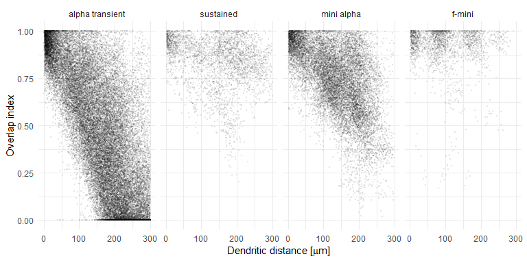
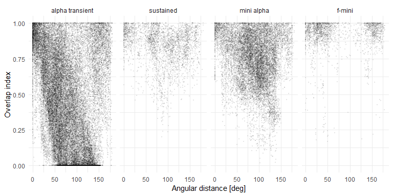
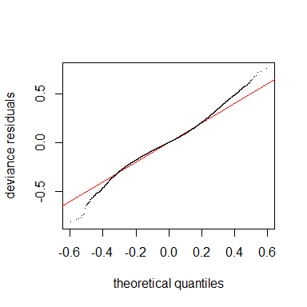
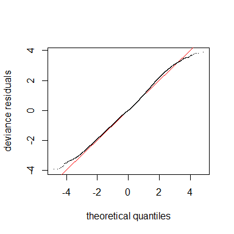
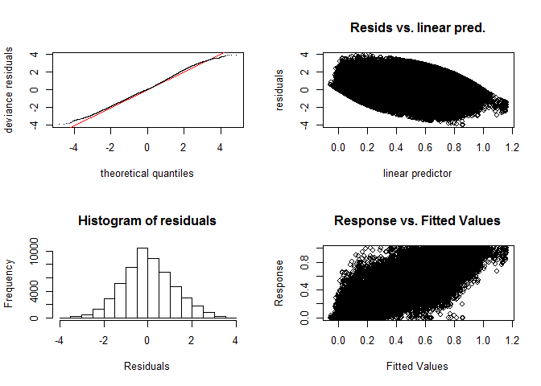
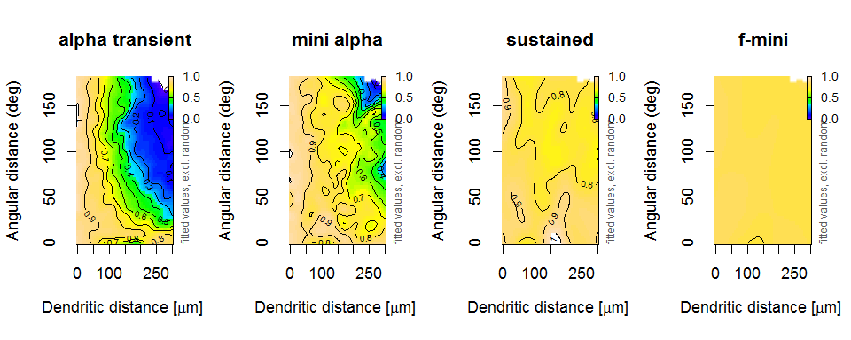
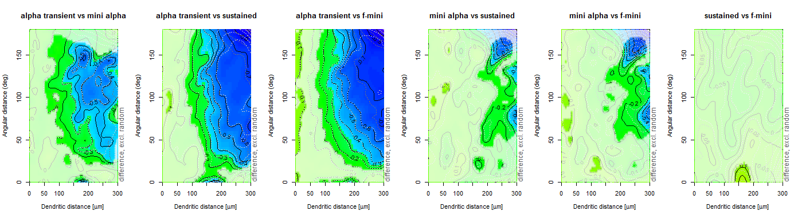

Analysis for RGC Dendrite Project (Overlap of RFs)
================
Philipp Berens
July 31, 2019

## Loading data

``` r
data <- read.csv("../../data/processed/overlap.csv", header=TRUE)

data <- plyr::rename(data, c("dendritic_distance_between_rois"="roi_dist"))

data <- plyr::rename(data, c("cbpt_angle_between_rois_deg"="angle", "overlap_index"="overlap"))

data <- dplyr::select(data, c("cell_id", "type", "roi_dist", "overlap", "angle"))

data$type <- factor(data$type)
data$type <- revalue(data$type, c("0"="alpha transient", "1"="sustained", "2" = "mini alpha", "3"="f-mini"))

cm <- max(data$cell_id[data$type=="alpha transient"])
data$cell_id[data$type=="sustained"] <- data$cell_id[data$type=="sustained"] + cm + 1
cm <- max(data$cell_id[data$type=="sustained"])
data$cell_id[data$type=="mini alpha"] <- data$cell_id[data$type=="mini alpha"] + cm + 1
cm <- max(data$cell_id[data$type=="mini alpha"])
data$cell_id[data$type=="f-mini"] <- data$cell_id[data$type=="f-mini"] + cm + 1

# we filter the data to ROI pairs with distance <300 
# so that all cells are compared on equal grounds
data1 <- filter(data, data$roi_dist<300)

# we use cell id as a random factor
data1$cell_id = factor(data1$cell_id)
```

## Overlap index vs. dendritic distance

Note that these first few plots here are mainly for getting an intuition
about the data. Inferences from them should be drawn with care, since
for each variable, I just average over all values of the other variable.
For slices through the fitted model, see below. Also, I removed the SE
bands, since they are not accurate as they do not take the repeated
measures in individual cells into account.

### All cell types individually

<!-- -->

## Overlap index vs. angular distance

\#\#\#All cell types individually
<!-- -->

## Overlap index vs. distance and angle

### Gaussian GAM without random effects for cell id

``` r
m1 <- gam(overlap ~ type + te(roi_dist, angle, by=type, k=10), data = data1)
summary(m1)
```

    ## 
    ## Family: gaussian 
    ## Link function: identity 
    ## 
    ## Formula:
    ## overlap ~ type + te(roi_dist, angle, by = type, k = 10)
    ## 
    ## Parametric coefficients:
    ##                 Estimate Std. Error t value Pr(>|t|)    
    ## (Intercept)    0.4651998  0.0008099 574.394  < 2e-16 ***
    ## typesustained  0.3708146  0.0046223  80.223  < 2e-16 ***
    ## typemini alpha 0.2575379  0.0052552  49.007  < 2e-16 ***
    ## typef-mini     0.4525145  0.0817070   5.538 3.07e-08 ***
    ## ---
    ## Signif. codes:  0 '***' 0.001 '**' 0.01 '*' 0.05 '.' 0.1 ' ' 1
    ## 
    ## Approximate significance of smooth terms:
    ##                                          edf Ref.df        F p-value    
    ## te(roi_dist,angle):typealpha transient 92.13  96.99 1308.449  <2e-16 ***
    ## te(roi_dist,angle):typesustained       60.96  73.08    8.170  <2e-16 ***
    ## te(roi_dist,angle):typemini alpha      98.55  98.95   77.893  <2e-16 ***
    ## te(roi_dist,angle):typef-mini          54.85  61.06    3.782  <2e-16 ***
    ## ---
    ## Signif. codes:  0 '***' 0.001 '**' 0.01 '*' 0.05 '.' 0.1 ' ' 1
    ## 
    ## R-sq.(adj) =  0.787   Deviance explained = 78.8%
    ## GCV = 0.022372  Scale est. = 0.022243  n = 54194

``` r
#gamtabs(m1, type="HTML")
```

### Gaussian GAM with random effects for cell id

``` r
m2 <- gam(overlap ~ type + te(roi_dist, angle, by=type, k=20) +
          s(cell_id, bs="re"), data = data1)
summary(m2)
```

    ## 
    ## Family: gaussian 
    ## Link function: identity 
    ## 
    ## Formula:
    ## overlap ~ type + te(roi_dist, angle, by = type, k = 20) + s(cell_id, 
    ##     bs = "re")
    ## 
    ## Parametric coefficients:
    ##                Estimate Std. Error t value Pr(>|t|)    
    ## (Intercept)     0.52825    0.02655  19.895  < 2e-16 ***
    ## typesustained   0.27973    0.06057   4.618 3.88e-06 ***
    ## typemini alpha  0.22530    0.05560   4.052 5.08e-05 ***
    ## typef-mini      0.28040    0.05594   5.012 5.39e-07 ***
    ## ---
    ## Signif. codes:  0 '***' 0.001 '**' 0.01 '*' 0.05 '.' 0.1 ' ' 1
    ## 
    ## Approximate significance of smooth terms:
    ##                                            edf  Ref.df       F p-value    
    ## te(roi_dist,angle):typealpha transient 275.087 325.977 389.462 < 2e-16 ***
    ## te(roi_dist,angle):typesustained        88.439 119.397   5.576 < 2e-16 ***
    ## te(roi_dist,angle):typemini alpha      261.254 301.427  29.617 < 2e-16 ***
    ## te(roi_dist,angle):typef-mini            4.554   5.694   3.289 0.00323 ** 
    ## s(cell_id)                              26.617  28.000 230.575 < 2e-16 ***
    ## ---
    ## Signif. codes:  0 '***' 0.001 '**' 0.01 '*' 0.05 '.' 0.1 ' ' 1
    ## 
    ## R-sq.(adj) =  0.814   Deviance explained = 81.6%
    ## GCV = 0.01964  Scale est. = 0.019401  n = 54194

Model comparison between the two models using AIC:

``` r
AIC(m1)
```

    ## [1] -52139.17

``` r
AIC(m2)
```

    ## [1] -59202.22

Model comparison between the two models using ANOVA:

``` r
anova(m1,m2, test="F")
```

    ## Analysis of Deviance Table
    ## 
    ## Model 1: overlap ~ type + te(roi_dist, angle, by = type, k = 10)
    ## Model 2: overlap ~ type + te(roi_dist, angle, by = type, k = 20) + s(cell_id, 
    ##     bs = "re")
    ##   Resid. Df Resid. Dev     Df Deviance      F    Pr(>F)    
    ## 1     53860     1198.5                                     
    ## 2     53411     1038.6 449.38   159.94 18.345 < 2.2e-16 ***
    ## ---
    ## Signif. codes:  0 '***' 0.001 '**' 0.01 '*' 0.05 '.' 0.1 ' ' 1

Because the AIC is more negative for m2 and the ANOVA yields a
significant difference between the two models, the random effects model
is better. Next, we want to check whether the assumptions of the model
on the noise are warranted (Gaussianity):

``` r
qq.gam(m2)
```

<!-- -->

The shape of the QQ-plot suggests that we need an error distribution
with more heavy tails, like a t-distribution.

### Question of reviewer concerning independence of axis

``` r
r2 <- gam(overlap ~ type + te(roi_dist, angle, by=type, k=10) +
          s(cell_id, bs="re"), data = data1)
summary(r2)
```

    ## 
    ## Family: gaussian 
    ## Link function: identity 
    ## 
    ## Formula:
    ## overlap ~ type + te(roi_dist, angle, by = type, k = 10) + s(cell_id, 
    ##     bs = "re")
    ## 
    ## Parametric coefficients:
    ##                Estimate Std. Error t value Pr(>|t|)    
    ## (Intercept)     0.52819    0.02970  17.784  < 2e-16 ***
    ## typesustained   0.28097    0.06779   4.145 3.40e-05 ***
    ## typemini alpha  0.21874    0.06223   3.515 0.000441 ***
    ## typef-mini      0.28013    0.06252   4.481 7.45e-06 ***
    ## ---
    ## Signif. codes:  0 '***' 0.001 '**' 0.01 '*' 0.05 '.' 0.1 ' ' 1
    ## 
    ## Approximate significance of smooth terms:
    ##                                           edf Ref.df        F p-value    
    ## te(roi_dist,angle):typealpha transient 82.263 91.758 1334.631 < 2e-16 ***
    ## te(roi_dist,angle):typesustained       53.581 66.351    9.208 < 2e-16 ***
    ## te(roi_dist,angle):typemini alpha      98.406 98.892   82.443 < 2e-16 ***
    ## te(roi_dist,angle):typef-mini           4.221  5.137    3.594 0.00274 ** 
    ## s(cell_id)                             26.687 27.000  240.363 < 2e-16 ***
    ## ---
    ## Signif. codes:  0 '***' 0.001 '**' 0.01 '*' 0.05 '.' 0.1 ' ' 1
    ## 
    ## R-sq.(adj) =  0.809   Deviance explained =   81%
    ## GCV = 0.020046  Scale est. = 0.019946  n = 54194

``` r
r1 <- gam(overlap ~ type + s(roi_dist, by=type, k=10) + s(roi_dist, by=type, k=10) +
          s(cell_id, bs="re"), data = data1)
summary(r1)
```

    ## 
    ## Family: gaussian 
    ## Link function: identity 
    ## 
    ## Formula:
    ## overlap ~ type + s(roi_dist, by = type, k = 10) + s(roi_dist, 
    ##     by = type, k = 10) + s(cell_id, bs = "re")
    ## 
    ## Parametric coefficients:
    ##                Estimate Std. Error t value Pr(>|t|)    
    ## (Intercept)     0.53752    0.04775  11.257  < 2e-16 ***
    ## typesustained   0.26803    0.10908   2.457  0.01401 *  
    ## typemini alpha  0.22377    0.09991   2.240  0.02511 *  
    ## typef-mini      0.28091    0.10016   2.805  0.00504 ** 
    ## ---
    ## Signif. codes:  0 '***' 0.001 '**' 0.01 '*' 0.05 '.' 0.1 ' ' 1
    ## 
    ## Approximate significance of smooth terms:
    ##                                    edf Ref.df        F p-value    
    ## s(roi_dist):typealpha transient  8.689  8.972 7326.222 < 2e-16 ***
    ## s(roi_dist):typesustained        3.990  4.935   34.025 < 2e-16 ***
    ## s(roi_dist):typemini alpha       5.373  6.508  683.640 < 2e-16 ***
    ## s(roi_dist):typef-mini           1.895  2.372    4.653 0.00686 ** 
    ## s(cell_id)                      26.820 27.000  432.189 < 2e-16 ***
    ## ---
    ## Signif. codes:  0 '***' 0.001 '**' 0.01 '*' 0.05 '.' 0.1 ' ' 1
    ## 
    ## R-sq.(adj) =  0.716   Deviance explained = 71.6%
    ## GCV = 0.029707  Scale est. = 0.029679  n = 54194

``` r
anova(r1,r2, test="F")
```

    ## Analysis of Deviance Table
    ## 
    ## Model 1: overlap ~ type + s(roi_dist, by = type, k = 10) + s(roi_dist, 
    ##     by = type, k = 10) + s(cell_id, bs = "re")
    ## Model 2: overlap ~ type + te(roi_dist, angle, by = type, k = 10) + s(cell_id, 
    ##     bs = "re")
    ##   Resid. Df Resid. Dev     Df Deviance     F    Pr(>F)    
    ## 1     54140     1606.9                                    
    ## 2     53901     1075.6 239.34   531.32 111.3 < 2.2e-16 ***
    ## ---
    ## Signif. codes:  0 '***' 0.001 '**' 0.01 '*' 0.05 '.' 0.1 ' ' 1

### T-distributed GAM with random effects for cell id

We fit a model with the same structure as before just assuming
t-distributed noise which has heavier
tails.

``` r
m3 <- bam(overlap ~ type + te(roi_dist, angle, by=type, k=20) + s(cell_id, bs="re"), 
          data = data1, 
          family=scat(min.df=5), 
          discrete=TRUE)
summary(m3)
```

    ## 
    ## Family: Scaled t(5,0.109) 
    ## Link function: identity 
    ## 
    ## Formula:
    ## overlap ~ type + te(roi_dist, angle, by = type, k = 20) + s(cell_id, 
    ##     bs = "re")
    ## 
    ## Parametric coefficients:
    ##                Estimate Std. Error t value Pr(>|t|)    
    ## (Intercept)     0.53482    0.02203  24.272  < 2e-16 ***
    ## typesustained   0.28516    0.05032   5.667 1.46e-08 ***
    ## typemini alpha  0.21369    0.04722   4.525 6.05e-06 ***
    ## typef-mini      0.28838    0.04706   6.128 8.96e-10 ***
    ## ---
    ## Signif. codes:  0 '***' 0.001 '**' 0.01 '*' 0.05 '.' 0.1 ' ' 1
    ## 
    ## Approximate significance of smooth terms:
    ##                                           edf Ref.df       F p-value    
    ## te(roi_dist,angle):typealpha transient 239.02 291.20 602.942  <2e-16 ***
    ## te(roi_dist,angle):typesustained        69.23  95.47   8.983  <2e-16 ***
    ## te(roi_dist,angle):typemini alpha      199.26 244.15  46.510  <2e-16 ***
    ## te(roi_dist,angle):typef-mini           14.02  19.21   1.885   0.011 *  
    ## s(cell_id)                              26.49  29.00 165.881  <2e-16 ***
    ## ---
    ## Signif. codes:  0 '***' 0.001 '**' 0.01 '*' 0.05 '.' 0.1 ' ' 1
    ## 
    ## R-sq.(adj) =   0.81   Deviance explained = 72.8%
    ## fREML =  86811  Scale est. = 1         n = 54194

``` r
qq.gam(m3)
```

<!-- -->

Now, the model has better fitting residuals, and compared with Model 2
above also lower AIC:

``` r
AIC(m3)
```

    ## [1] -61825.32

``` r
gam.check(m3)
```

<!-- -->

    ## 
    ## Method: fREML   Optimizer: perf chol
    ## $grad
    ## [1]  1.420796e-06  5.708772e-07  7.121089e-06  5.994386e-06  3.133596e-06
    ## [6]  1.881471e-06 -3.766455e-06 -3.366457e-06 -3.911420e-07
    ## 
    ## $hess
    ##                [,1]          [,2]          [,3]          [,4]
    ##  [1,]  2.478882e+01  3.255914e+00  1.503810e-17 -4.478573e-18
    ##  [2,]  3.255914e+00  2.739830e+01  2.349311e-16 -6.996600e-17
    ##  [3,] -4.121214e-18  3.930160e-17  6.302214e+00  2.193557e-01
    ##  [4,]  5.601799e-19 -1.803492e-17  2.193557e-01  2.136839e+00
    ##  [5,] -2.019870e-17  2.577282e-16  2.589529e-28 -1.023216e-28
    ##  [6,]  1.246222e-17 -1.435463e-18 -2.714308e-29  1.182414e-29
    ##  [7,] -4.132771e-18  1.145629e-17 -7.364049e-30  4.189915e-30
    ##  [8,] -2.586786e-18 -4.209869e-18 -3.485104e-30  2.942151e-30
    ##  [9,]  6.851929e-02  4.038173e-02 -3.205473e-02  2.863025e-02
    ##                [,5]          [,6]          [,7]          [,8]         [,9]
    ##  [1,]  1.312647e-17 -3.407805e-17 -6.449641e-19 -5.318733e-18  0.068519291
    ##  [2,]  2.050668e-16 -5.323805e-16 -1.007588e-17 -8.309129e-17  0.040381733
    ##  [3,]  1.047098e-28 -3.940737e-29 -1.556312e-30 -5.902863e-30 -0.032054733
    ##  [4,] -6.552981e-29  3.257842e-29  2.014660e-30  4.750787e-30  0.028630246
    ##  [5,]  2.537166e+01  3.275061e+00 -4.593856e-29 -7.362408e-29  0.009533369
    ##  [6,]  3.275061e+00  1.599388e+01  9.213825e-30  8.030753e-30  0.002397437
    ##  [7,] -1.588938e-29  1.739809e-29  5.044094e-01 -2.699281e-01  0.040124744
    ##  [8,] -1.452000e-29  1.064315e-29 -2.699281e-01  6.704062e-01  0.051984478
    ##  [9,]  9.533369e-03  2.397437e-03  4.012474e-02  5.198448e-02 12.533174921
    ## 
    ## Model rank =  1631 / 1631 
    ## 
    ## Basis dimension (k) checking results. Low p-value (k-index<1) may
    ## indicate that k is too low, especially if edf is close to k'.
    ## 
    ##                                           k'   edf k-index p-value
    ## te(roi_dist,angle):typealpha transient 399.0 239.0    1.01    0.78
    ## te(roi_dist,angle):typesustained       399.0  69.2    1.01    0.81
    ## te(roi_dist,angle):typemini alpha      399.0 199.3    1.00    0.64
    ## te(roi_dist,angle):typef-mini          399.0  14.0    1.01    0.81
    ## s(cell_id)                              31.0  26.5      NA      NA

## Model visualization and analysis of the differences

### Nonlinear effects

First we visualize the fitted surfaces:

<!-- --> \#\#\# Significance
analysis

Next, we can use the model to compute differences between the cell types
and assess, where these are significantly different (assuming 99%-CIs).
All white regions do not show significant differences.

<!-- -->

### Summary

The receptive field overlap is most obviously different between the
transient alpha and all other RGC types. For large dendritic distances
and large angular distances, the overlap of RFs goes down a lot for
these cells. Interestingly, the mini alpha seems to follow this pattern
somewhat, althoughnot as much. Both the sustained and the f-mini are
very different, there RFs overlap everywhere almost completely.
